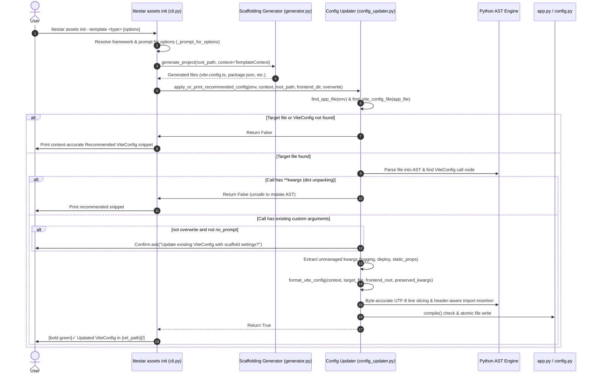

# Comprehensive Architectural Fix Plan: AST-Based `ViteConfig` Auto-Updating (PR #352)

**Target PR**: [`litestar-org/litestar-vite#352`](https://github.com/litestar-org/litestar-vite/pull/352) — *feat(cli): auto update ViteConfig at the end of init process*  
**Base Commit**: `1b6f71e123e319dcde135e0e24f4ad5f3013ec54` (`origin/main`, tag `v0.31.0`)  
**PR Head Commit**: `3736f0e9997861d81a71a57824f3b9474a69872a` (`origin/feat-viteconfig-update`)  
**Author**: Harshal Laheri (`@Harshal6927`)  
**Document Purpose**: A self-contained, end-to-end architectural analysis and implementation guide. Any autonomous agent or software engineer with zero prior context can follow this document to understand every failure mode in PR #352 and execute the complete remediation without regressions.

---

## Table of Contents
1. [Executive Summary & Direct Issues Matrix](#1-executive-summary--direct-issues-matrix)
2. [Deep Dive: Direct Issues with PR #352 & Root Cause Analysis](#2-deep-dive-direct-issues-with-pr-352--root-cause-analysis)
   - [2.1 Issue 1: Flawed Binary Template Heuristic & Matrix of All 21 Frameworks](#21-issue-1-flawed-binary-template-heuristic--matrix-of-all-21-frameworks)
   - [2.2 Issue 2: Dropped CLI & Interactive Prompt Context (`TemplateContext` Disconnect)](#22-issue-2-dropped-cli--interactive-prompt-context-templatecontext-disconnect)
   - [2.3 Issue 3: Broken Relative `root` Path Evaluation in Subdirectories](#23-issue-3-broken-relative-root-path-evaluation-in-subdirectories)
   - [2.4 Issue 4: Destructive AST Call Overwriting & User Configuration Loss](#24-issue-4-destructive-ast-call-overwriting--user-configuration-loss)
   - [2.5 Issue 5: Python AST UTF-8 Byte Offset vs. Unicode Character Slicing Bug](#25-issue-5-python-ast-utf-8-byte-offset-vs-unicode-character-slicing-bug)
   - [2.6 Issue 6: Shebang, PEP 263 Encoding, and Import Splicing Bugs](#26-issue-6-shebang-pep-263-encoding-and-import-splicing-bugs)
   - [2.7 Issue 7: Path Traversal Vulnerability & Entrypoint-Only Discovery Limitation](#27-issue-7-path-traversal-vulnerability--entrypoint-only-discovery-limitation)
   - [2.8 Issue 8: Repository Hygiene (`.gitignore` Pollution)](#28-issue-8-repository-hygiene-gitignore-pollution)
3. [Architectural Specification & Invariants](#3-architectural-specification--invariants)
4. [Complete Production-Ready Code Implementation](#4-complete-production-ready-code-implementation)
   - [4.1 `src/py/litestar_vite/config_updater.py`](#41-srcpylitestar_viteconfig_updaterpy)
   - [4.2 `src/py/litestar_vite/cli.py` Updates](#42-srcpylitestar_viteclipy-updates)
5. [Exhaustive Test Suite](#5-exhaustive-test-suite)
   - [5.1 `src/py/tests/unit/test_config_updater.py`](#51-srcpytestsunittest_config_updaterpy)
   - [5.2 `src/py/tests/unit/test_cli.py` Updates](#52-srcpytestsunittest_clipy-updates)
6. [Step-by-Step Implementation Guide for Autonomous Agents](#6-step-by-step-implementation-guide-for-autonomous-agents)
7. [Constructive GitHub Review Response for the Contributor](#7-constructive-github-review-response-for-the-contributor)

---

## 1. Executive Summary & Direct Issues Matrix

PR #352 attempts to streamline user onboarding by parsing the user's Litestar application entrypoint using Python's standard `ast` module and rewriting `ViteConfig(...)` when running `litestar assets init` (`vite_init`). If updating fails, it falls back to printing the recommended snippet.

While the feature intent is excellent, the PR as currently implemented contains **critical architectural flaws, severe data-loss bugs, syntax-corruption hazards, and broken configuration generation for 19 out of 21 supported templates**.

The following matrix documents each direct issue, its root cause, and the direct architectural fix:

| Issue ID | Affected Method / Component | Root Cause in PR #352 | Direct Fix | Why the Fix is Required / Impact |
| :--- | :--- | :--- | :--- | :--- |
| **DIR-01** | `config_updater.format_vite_config` | Hardcoded `spa_templates = {"react-router", "react-tanstack"}` and sets `mode="spa" if name in spa_templates else "template"`. | Replace heuristic with `_resolve_template_mode(framework_type, enable_inertia)` mapping all 21 `FrameworkType` variants to canonical modes (`spa`, `hybrid`, `template`, `ssr`, `ssg`, `framework`). | **Critical.** SPA templates (`react`, `vue`, `svelte`, `angular`) get written with `mode="template"`, which disables the SPA catch-all route and 404s `index.html`. Inertia, SSR, SSG, and Angular CLI templates get completely broken configs. |
| **DIR-02** | `cli._apply_or_print_recommended_config` & `cli.vite_init` | `_apply_or_print_recommended_config` accepts primitive strings and drops `TemplateContext`, ignoring `--enable-ssr`, `--generate-zod`, `--generate-client`, `--vite-port`, `--asset-url`, and `--static-path`. | Pass the full `TemplateContext` object directly from `vite_init` to `format_vite_config` and `_apply_or_print_recommended_config`. | **High.** Scaffolding files (`vite.config.ts`, `package.json`) use the user's selected ports, paths, and flags, while `ViteConfig` in `app.py` is written with hardcoded defaults. Frontend and backend immediately desynchronize. |
| **DIR-03** | `config_updater.format_vite_config` | Hardcodes `root=Path(__file__).parent` (or `Path(__file__).parent / "{frontend_dir}"`). | Compute relative root path via `os.path.relpath(frontend_root, target_file.parent)` and emit `Path(__file__).resolve().parents[N]` or parent traversals. | **High.** When `app.py` or `__init__.py` is in a subdirectory (e.g., `src/my_app/main.py`), `Path(__file__).parent` points to `src/my_app/`, where no `package.json` exists. `VitePlugin` crashes on startup. |
| **DIR-04** | `config_updater.update_vite_config_in_file` & `cli.vite_init` | Slices out the entire `ast.Call` node and replaces it wholesale. Runs unconditionally without checking `--overwrite` or prompting. | Implement non-destructive AST keyword merging (`preserve_user_kwargs`), preserve unmanaged keys (`logging`, `deploy`, `spa`, `static_props`, `enabled`), and prompt via `Confirm.ask` when overwriting custom configs. | **High.** Silently destroys all existing user customizations, custom plugins, CDN deploy settings, logging configs, and inline comments in `app.py`. |
| **DIR-05** | `config_updater.update_vite_config_in_file` | Uses `call_node.col_offset` and `end_col_offset` as Python `str` character indices. | Slices lines using UTF-8 byte offsets via `_byte_slice(line, start_col, end_col)` or code-point conversions. | **High.** In Python's `ast`, offsets are UTF-8 byte offsets. Any multi-byte UTF-8 character (emoji in comments, non-ASCII strings) on the `ViteConfig` line shifts offsets, slicing mid-token and corrupting code. |
| **DIR-06** | `config_updater._find_import_insert_line` & `_ensure_imports` | `_find_import_insert_line` returns `0` when no docstring exists; rewrites `from litestar_vite import *` into invalid syntax; overwrites multi-line import tracking. | Advance insert line past shebang (`#!`) and PEP 263 headers (`# coding: ...`); aggregate across all import statements; skip modifying wildcard (`*`) imports. | **High.** Inserting imports at line 0 breaks executable UNIX shebangs and PEP 263 encoding cookies (`SyntaxError`). Wildcard imports produce invalid syntax `from litestar_vite import *, PathConfig`. |
| **DIR-07** | `config_updater.find_app_file` | Fallback candidates loop omits `is_relative_to(cwd_resolved)` security check; only inspects the single entrypoint module from `env.app_path`. | Enforce `is_relative_to(cwd_resolved)` on all candidate paths; inspect imported local project modules in `cwd` if `ViteConfig` is defined in a separate config module (e.g. `app/config.py`). | **Medium.** Prevents path traversal outside `cwd`; enables auto-updating in standard modular Litestar architectures where `app.py` imports `vite_config` from `config.py`. |
| **DIR-08** | `.gitignore` | Adds `plans/` to the repository `.gitignore`. | Keep addition in `.gitignore` under AI Agent Systems. | **Accepted.** Consistent with local AI infrastructure conventions alongside `specs/`, `.gemini/`, and `.claude/`. |

---

## 2. Deep Dive: Direct Issues with PR #352 & Root Cause Analysis

### 2.1 Issue 1: Flawed Binary Template Heuristic & Matrix of All 21 Frameworks

#### The Problem in PR #352
In `src/py/litestar_vite/config_updater.py` (lines 67–68):
```python
spa_templates = {"react-router", "react-tanstack"}
mode = "spa" if template_name in spa_templates else "template"
```
The author copied this heuristic from `_print_recommended_config` in `cli.py`. That helper was originally written when only a few templates existed. However, `litestar-vite` now supports **21 distinct framework templates** via [`templates.py:FrameworkType`](file:///usr/local/google/home/codyfincher/.gemini/jetski/worktrees/litestar-vite/review_harshal_pr_analysis/src/py/litestar_vite/scaffolding/templates.py#L15-L39).

#### Why It Breaks
In [`_vite.py:L140-L163`](file:///usr/local/google/home/codyfincher/.gemini/jetski/worktrees/litestar-vite/review_harshal_pr_analysis/src/py/litestar_vite/config/_vite.py#L140-L163), `ViteConfig` defines 4 canonical modes and 5 aliases:
1. `mode="spa"`: Litestar serves `index.html` as a catch-all route (`/{path:path}`); client-side routers own navigation.
2. `mode="hybrid"`: Litestar serves prebuilt `index.html` with Vite scripts injected; route handlers return Inertia component responses (`InertiaResponse`).
3. `mode="template"`: Litestar serves per-route HTML via Jinja2/Mako/raw strings. HTMX flows and Jinja-shell Inertia use this mode.
4. `mode="framework"`: External dev server (or SSR/SSG proxy) owns HTML rendering; Litestar proxies non-API routes via `SSRProxyMiddleware`.
   - Aliases: `"inertia"` &rarr; `"hybrid"`, `"htmx"` &rarr; `"template"`, `"ssr"` / `"ssg"` &rarr; `"framework"`, `"external"` &rarr; `"framework"`.

By forcing `mode="template"` on everything except `react-router` and `react-tanstack`, PR #352:
- **Destroys standard SPAs (`react`, `vue`, `svelte`, `angular`)**: `mode="template"` causes `VitePlugin` to **not** register the SPA catch-all handler. Loading `/` returns a 404 or fails to serve `index.html`.
- **Destroys all Inertia templates**: It omits `inertia=InertiaConfig(...)` and forces `mode="template"`, breaking Inertia protocol handling and asset injection.
- **Destroys SSR/SSG meta-frameworks (`sveltekit`, `nuxt`, `astro`)**: Omits `mode="ssr"` / `mode="ssg"` and framework-specific TypeGen paths.
- **Destroys Angular CLI**: Omits `mode="framework"` and `ExternalDevServer`.

#### Exhaustive 21-Template Comparison Matrix
The table below specifies exactly what PR #352 emits versus what the corrected updater must emit for all 21 templates:

| Template Name (`FrameworkType`) | Mode in PR #352 | Correct Canonical Mode | Required Sub-Configurations & TypeGen Settings |
| :--- | :--- | :--- | :--- |
| `react` | `"template"` *(BROKEN)* | `"spa"` | `types=True` (or `TypeGenConfig(...)` if Zod/client flags set) |
| `react-router` | `"spa"` | `"spa"` | `types=True` |
| `react-tanstack` | `"spa"` | `"spa"` | `types=TypeGenConfig(extra_commands=[["tsr", "generate"]])` |
| `react-inertia` | `"template"` *(BROKEN)* | `"hybrid"` | `inertia=InertiaConfig()`, `types=TypeGenConfig(output=Path("resources/generated"))` |
| `react-inertia-jinja` | `"template"` | `"template"` | `inertia=InertiaConfig()`, `types=TypeGenConfig(output=Path("resources/generated"))` |
| `vue` | `"template"` *(BROKEN)* | `"spa"` | `types=True` |
| `vue-inertia` | `"template"` *(BROKEN)* | `"hybrid"` | `inertia=InertiaConfig()`, `types=TypeGenConfig(output=Path("resources/generated"))` |
| `vue-inertia-ssr` | `"template"` *(BROKEN)* | `"hybrid"` | `inertia=InertiaConfig(ssr=InertiaSSRConfig(command=["npm", "run", "dev:ssr"]))`, `types=TypeGenConfig(output=Path("resources/generated"))` |
| `vue-inertia-jinja` | `"template"` | `"template"` | `inertia=InertiaConfig()`, `types=TypeGenConfig(output=Path("resources/generated"))` |
| `vue-inertia-jinja-ssr`| `"template"` *(BROKEN)* | `"template"` | `inertia=InertiaConfig(ssr=InertiaSSRConfig(command=["npm", "run", "dev:ssr"]))`, `types=TypeGenConfig(output=Path("resources/generated"))` |
| `svelte` | `"template"` *(BROKEN)* | `"spa"` | `types=True` |
| `svelte-inertia` | `"template"` *(BROKEN)* | `"hybrid"` | `inertia=InertiaConfig()`, `types=TypeGenConfig(output=Path("resources/generated"))` |
| `svelte-inertia-jinja` | `"template"` | `"template"` | `inertia=InertiaConfig()`, `types=TypeGenConfig(output=Path("resources/generated"))` |
| `sveltekit` | `"template"` *(BROKEN)* | `"ssr"` | `types=TypeGenConfig(output=Path("src/lib/generated"))` |
| `nuxt` | `"template"` *(BROKEN)* | `"ssr"` | `types=TypeGenConfig(output=Path("app/generated"))` |
| `astro` | `"template"` *(BROKEN)* | `"ssg"` | `paths=PathConfig(bundle_dir="dist")` |
| `htmx` | `"template"` | `"template"` | `types=False` by default (HTML only; `uses_typescript=False`) |
| `jinja-htmx` | `"template"` | `"template"` | `types=False` by default (`uses_typescript=False`) |
| `htmx-no-jinja` | `"template"` | `"template"` | `types=False` by default (`uses_typescript=False`) |
| `angular` | `"template"` *(BROKEN)* | `"spa"` | `types=True` |
| `angular-cli` | `"template"` *(BROKEN)* | `"framework"` | `runtime=RuntimeConfig(external_dev_server=ExternalDevServer(target="http://127.0.0.1:4200", command=["npm", "run", "start"], build_command=["npm", "run", "build"]))` |

---

### 2.2 Issue 2: Dropped CLI & Interactive Prompt Context (`TemplateContext` Disconnect)

#### The Problem in PR #352
In `cli.py`, `vite_init` prompts the user for configuration options or reads flags:
- `--enable-ssr` / `--disable-ssr`
- `--enable-types` / `--no-enable-types`
- `--generate-zod`
- `--generate-client` / `--no-generate-client`
- `--vite-port`
- `--asset-url`
- `--static-path`
- `--frontend-dir`

All of these are assembled into `context = TemplateContext(...)` and passed to `generate_project(root_path, context)` to scaffold frontend configuration files (`vite.config.ts`, `package.json`, `tsconfig.json`).

However, PR #352 defines `_apply_or_print_recommended_config` as:
```python
def _apply_or_print_recommended_config(
    env: "LitestarEnv",
    template_name: str,
    resource_dir: str,
    bundle_dir: str,
    frontend_dir: str = ".",
    enable_types: bool | None = None,
) -> None:
```
And calls it from `vite_init` as:
```python
_apply_or_print_recommended_config(
    env=env,
    template_name=template,
    resource_dir=context.resource_dir,
    bundle_dir=context.bundle_dir,
    frontend_dir=frontend_dir,
    enable_types=enable_types,
)
```

#### Why It Breaks
- If the user selects `--generate-zod`, `generate_project` adds `zod` to `package.json` and configures `openapi-ts.config.ts`. But `_apply_or_print_recommended_config` **never receives `generate_zod`**, so it writes `types=True` instead of `types=TypeGenConfig(generate_zod=True)`. Litestar's route type generator will never emit Zod schemas.
- If the user specifies `--vite-port 5174`, `vite.config.ts` runs on port 5174, but `ViteConfig` in `app.py` has no `runtime=RuntimeConfig(port=5174)`. Litestar attempts to connect to the default port 5173 and fails to proxy assets or hot-reload.
- If the user selects `--enable-ssr` on an Inertia template, SSR server runner commands are generated in `package.json`, but `app.py` omits `InertiaSSRConfig`.

#### Direct Fix
Pass `context: TemplateContext` directly into `_apply_or_print_recommended_config` and `format_vite_config`. Derive all emitted `ViteConfig` arguments directly from `context`.

---

### 2.3 Issue 3: Broken Relative `root` Path Evaluation in Subdirectories

#### The Problem in PR #352
In `config_updater.py` (lines 74–76):
```python
root_expr = "Path(__file__).parent"
if frontend_dir and frontend_dir != ".":
    root_expr = f'Path(__file__).parent / "{frontend_dir}"'
```

#### Why It Breaks
In Python and Litestar project layouts, application entrypoints are rarely located in the repository root alongside `pyproject.toml`. Standard layouts include:
- `src/my_app/app.py` or `src/my_app/main.py` (PEP 517/518 `src/` layout)
- `app/asgi.py` or `app/main.py`
- `my_package/__init__.py`

In all of these layouts, `vite_init` scaffolds the frontend into `root_path / frontend_dir` (which defaults to `env.cwd`, the repository root).
When `app_file` is `src/my_app/main.py`:
- `Path(__file__).parent` evaluates at runtime to `/path/to/repo/src/my_app`!
- The frontend was scaffolded into `/path/to/repo`!
- `VitePlugin` searches `/path/to/repo/src/my_app/package.json` and `/path/to/repo/src/my_app/vite.config.ts`, throws `ViteExecutionError`, and refuses to start!

Notice that PR #352's own unit test `test_find_app_file_package_init` explicitly tests resolving `my_app/__init__.py`, proving the author anticipated nested files, but completely failed to calculate `root` relative to that nested file.

#### Direct Fix
Calculate the exact relative path from `target_file.parent.resolve()` to `frontend_root.resolve()`:
```python
def _compute_root_expr(target_file: Path | None, frontend_root: Path) -> str:
    if target_file is None:
        return "Path(__file__).parent"
    try:
        rel = os.path.relpath(frontend_root.resolve(), target_file.parent.resolve())
    except ValueError:
        return f'Path("{frontend_root.as_posix()}")'

    parts = Path(rel).parts
    up_count = sum(1 for p in parts if p == "..")
    down_parts = [p for p in parts if p not in (".", "..")]

    if up_count == 0:
        base = "Path(__file__).parent"
    elif up_count == 1:
        base = "Path(__file__).parent.parent"
    else:
        base = f"Path(__file__).resolve().parents[{up_count}]"

    if not down_parts:
        return base
    joined = "/".join(down_parts)
    return f'{base} / "{joined}"'
```

---

### 2.4 Issue 4: Destructive AST Call Overwriting & User Configuration Loss

#### The Problem in PR #352
In `config_updater.py` (lines 248–254):
```python
prefix = "".join(source_lines[: start_lineno - 1]) + source_lines[start_lineno - 1][:start_col]
suffix = source_lines[end_lineno - 1][end_col:] + "".join(source_lines[end_lineno:])
new_source = prefix + replacement_str + suffix
```

#### Why It Breaks
1. **Destroys Existing Configuration**:
   Suppose the user already configured:
   ```python
   vite_config = ViteConfig(
       dev_mode=True,
       runtime=RuntimeConfig(executor="bun", port=3000),
       deploy=DeployConfig(endpoint="https://cdn.example.com"),
       logging=LoggingConfig(suppress_vite_banner=True),
       static_props={"version": "1.0.0"},
   )
   ```
   PR #352 completely discards all existing AST keywords and overwrites `vite_config` with its generic 5-line string. Every custom configuration setting is wiped out.
2. **Destroys Inline Comments**:
   Comments inside `ViteConfig(...)` are discarded by `ast.parse` and removed when the node is replaced.
3. **Violates `--overwrite` and Prompts**:
   `vite_init` checks `--overwrite` before scaffolding files. However, `_apply_or_print_recommended_config` unconditionally mutates `app.py` on disk without asking confirmation (`Confirm.ask`) and even when `overwrite=False`.

#### Direct Fix
1. Inspect `call_node.keywords`.
2. Categorize keyword arguments:
   - Scaffolding-managed keys: `mode`, `dev_mode`, `paths`, `types`, `inertia`, `runtime` (when customized).
   - User-managed keys: `logging`, `deploy`, `spa`, `static_props`, `enabled`, `base_url`.
3. Extract unmanaged user keywords directly from source lines via `ast.get_source_segment(source, kw_node)` and append them into the generated `ViteConfig(...)` call.
4. If `ViteConfig(...)` contains existing arguments and `not overwrite and not no_prompt`, prompt via `Confirm.ask("Existing ViteConfig has custom configuration. Update with scaffold settings?")`.

---

### 2.5 Issue 5: Python AST UTF-8 Byte Offset vs. Unicode Character Slicing Bug

#### The Problem in PR #352
In `config_updater.py` (lines 242–252):
```python
start_col = call_node.col_offset
end_col = call_node.end_col_offset
...
prefix = "".join(source_lines[: start_lineno - 1]) + source_lines[start_lineno - 1][:start_col]
suffix = source_lines[end_lineno - 1][end_col:] + "".join(source_lines[end_lineno:])
```

#### Why It Breaks
In the CPython implementation of `ast`:
> `node.col_offset` and `node.end_col_offset` represent the **UTF-8 byte offset** of the token in the line, **NOT** the Python `str` character index (code point index).

If a line contains non-ASCII characters (e.g., `# 🚀 Vite configuration` or a string `title = "Café"`):
- The UTF-8 byte length of `🚀` is 4 bytes, but its string character length is 1 code point (or 2 surrogate characters).
- `col_offset` will be greater than `char_index` by 3.
- `source_lines[i][:start_col]` slices 3 characters too far to the right, eating into the identifier `ViteConfig(` or leaving garbled syntax!
- `compile()` will fail with a `SyntaxError`, or worse, the file will be silently corrupted.

#### Direct Fix
Implement a byte-accurate slicing helper:
```python
def _byte_slice(line: str, start_byte: int, end_byte: int | None = None) -> str:
    encoded = line.encode("utf-8")
    return encoded[start_byte:end_byte].decode("utf-8")
```

---

### 2.6 Issue 6: Shebang, PEP 263 Encoding, and Import Splicing Bugs

#### The Problem in PR #352
In `config_updater.py` (lines 135–204):
```python
def _find_import_insert_line(tree: ast.Module) -> int:
    insert_line = 0
    ...
    return insert_line
```
And:
```python
def _ensure_imports(source: str, need_typegen: bool) -> str:
    ...
    if not _has_path_import(tree):
        insert_idx = _find_import_insert_line(tree)
        lines.insert(insert_idx, "from pathlib import Path\n")
```

#### Why It Breaks
1. **Destroys UNIX Shebang & PEP 263 Headers**:
   If an application file has no module docstring (e.g. starting with `#!/usr/bin/env python3` or `# -*- coding: utf-8 -*-`), `_find_import_insert_line` returns `0`.
   `lines.insert(0, ...)` inserts the import at **Line 1**, pushing `#!/usr/bin/env python3` to Line 2 (breaking direct shell execution) and pushing PEP 263 encoding declarations past line 2 (which is an immediate `SyntaxError` in Python on non-ASCII files).
2. **Wildcard Import Corruption**:
   If a user has `from litestar_vite import *`, `_ensure_imports` extracts alias `"*"` and emits:
   ```python
   from litestar_vite import *, PathConfig, ViteConfig
   ```
   This is a Python `SyntaxError` (`import * only allowed at module level` and cannot be combined with named imports).
3. **Duplicate Imports Across Multiple Statements**:
   `for node in tree.body:` overwrites `litestar_vite_import_node` with the *last* matching statement, ignoring earlier ones. If `VitePlugin` is on line 2 and `ViteConfig` is on line 3, it sees `ViteConfig` missing from line 2 and creates duplicate imports.

#### Direct Fix
1. Scan lines 1 and 2 for shebangs (`#!`) and PEP 263 regex patterns (`coding[:=]`) before setting the base `insert_line`.
2. Aggregate all imported names across **all** `ImportFrom` and `Import` statements in `tree.body`.
3. If `*` is present in any `ImportFrom`, do not append named imports to that statement.

---

### 2.7 Issue 7: Path Traversal Vulnerability & Entrypoint-Only Discovery Limitation

#### The Problem in PR #352
In `find_app_file(env: LitestarEnv)`:
```python
# Check sys.modules if already imported, but never edit files outside the project.
module = sys.modules.get(target)
if module is not None:
    source_file = inspect.getsourcefile(module) or getattr(module, "__file__", None)
    if source_file:
        mod_path = Path(source_file).resolve()
        if mod_path.is_file() and mod_path.is_relative_to(cwd_resolved):
            return mod_path

parts = target.split(".")
candidates = [
    env.cwd / target,
    env.cwd / f"{target}.py",
    env.cwd.joinpath(*parts).with_suffix(".py"),
    env.cwd.joinpath(*parts) / "__init__.py",
]
for candidate in candidates:
    if candidate.is_file():
        return candidate.resolve()  # <-- MISSING is_relative_to(cwd_resolved)!
```

#### Why It Breaks
1. If `env.app_path` contains `../` or a symlink outside `env.cwd`, `candidate.resolve()` can return a path outside the project directory, violating the stated security boundary.
2. In many production applications, `env.app_path` is `app.main:app`, but `ViteConfig` is defined in `app/config.py` and imported as `from app.config import vite_config`. Because `find_app_file` only returns `app/main.py`, `_find_vite_config_call` returns `None` and auto-updating fails completely.

#### Direct Fix
1. Check `candidate.resolve().is_relative_to(cwd_resolved)` in the candidates loop.
2. If `ViteConfig` is not found in the primary app file, inspect local modules imported by that file (within `cwd_resolved`) to find the file where `ViteConfig(...)` is called.

---

### 2.8 Note on Repository `.gitignore`: Retain `plans/`

PR #352 adds `plans/` to the repository `.gitignore` under the `# AI Agent Systems (Gemini & Claude)` section. This addition is consistent with repository patterns alongside `specs/`, `.gemini/`, and `.claude/` and should be retained.

---

## 3. Architectural Specification & Invariants



### Core Invariants

1. **Context Equivalence**: The string emitted into `app.py` MUST match the configuration generated into `vite.config.ts` and `package.json` for all 21 templates.
2. **Non-Destructive Preservation**: Unmanaged keyword arguments (`logging`, `deploy`, `spa`, `static_props`, `enabled`, `base_url`) in an existing `ViteConfig(...)` call MUST be preserved verbatim.
3. **Byte-Safe Encoding**: AST column offsets MUST be indexed as UTF-8 bytes to guarantee immunity against multi-byte character offset drift.
4. **Header Safety**: Shebangs (`#!`) and PEP 263 encoding comments MUST remain on line 1/2.
5. **Path Sandboxing**: No file outside `env.cwd` shall ever be resolved or modified.

---

## 4. Complete Production-Ready Code Implementation

### 4.1 `src/py/litestar_vite/config_updater.py`

Replace `src/py/litestar_vite/config_updater.py` with the following complete, fully typed, docstring-documented implementation:

```python
"""Utilities for safely updating ViteConfig in Python application files using AST inspection."""

import ast
import inspect
import os
import re
import sys
from dataclasses import dataclass
from pathlib import Path
from typing import TYPE_CHECKING

from litestar_vite.scaffolding.templates import FrameworkType

if TYPE_CHECKING:
    from litestar.cli._utils import LitestarEnv
    from litestar_vite.scaffolding.generator import TemplateContext

_PEP263_RE = re.compile(r"^[ \t\f]*#.*?coding[:=][ \t]*([-\w.]+)")


@dataclass(frozen=True)
class FormattedConfigResult:
    """Formatted ViteConfig call string and its required imports."""

    code: str
    litestar_vite_imports: set[str]
    needs_path_import: bool


def _byte_slice(line: str, start_byte: int, end_byte: int | None = None) -> str:
    """Slice a Python string using UTF-8 byte offsets.

    Python AST ``col_offset`` and ``end_col_offset`` represent UTF-8 byte offsets.
    Direct character indexing corrupts source lines containing multi-byte characters.
    """
    encoded = line.encode("utf-8")
    return encoded[start_byte:end_byte].decode("utf-8")


def _compute_root_expr(target_file: Path | None, frontend_root: Path) -> str:
    """Compute the Python expression for PathConfig.root relative to target_file."""
    if target_file is None:
        return "Path(__file__).parent"

    try:
        rel = os.path.relpath(frontend_root.resolve(), target_file.parent.resolve())
    except ValueError:
        return f'Path("{frontend_root.as_posix()}")'

    parts = Path(rel).parts
    up_count = sum(1 for p in parts if p == "..")
    down_parts = [p for p in parts if p not in (".", "..")]

    if up_count == 0:
        base = "Path(__file__).parent"
    elif up_count == 1:
        base = "Path(__file__).parent.parent"
    else:
        base = f"Path(__file__).resolve().parents[{up_count}]"

    if not down_parts:
        return base
    joined = "/".join(down_parts)
    return f'{base} / "{joined}"'


def _resolve_template_mode(framework_type: FrameworkType, enable_inertia: bool) -> str:
    """Determine the canonical ViteConfig mode for a scaffolded template."""
    if framework_type in {
        FrameworkType.REACT,
        FrameworkType.REACT_ROUTER,
        FrameworkType.REACT_TANSTACK,
        FrameworkType.VUE,
        FrameworkType.SVELTE,
        FrameworkType.ANGULAR,
    }:
        return "spa"
    if framework_type in {
        FrameworkType.REACT_INERTIA,
        FrameworkType.VUE_INERTIA,
        FrameworkType.VUE_INERTIA_SSR,
        FrameworkType.SVELTE_INERTIA,
    }:
        return "hybrid"
    if framework_type in {
        FrameworkType.REACT_INERTIA_JINJA,
        FrameworkType.VUE_INERTIA_JINJA,
        FrameworkType.VUE_INERTIA_JINJA_SSR,
        FrameworkType.SVELTE_INERTIA_JINJA,
        FrameworkType.HTMX,
        FrameworkType.JINJA_HTMX,
        FrameworkType.HTMX_NO_JINJA,
    }:
        return "template"
    if framework_type in {FrameworkType.SVELTEKIT, FrameworkType.NUXT}:
        return "ssr"
    if framework_type == FrameworkType.ASTRO:
        return "ssg"
    if framework_type == FrameworkType.ANGULAR_CLI:
        return "framework"
    return "spa" if not enable_inertia else "hybrid"


def _resolve_typegen_output(framework_type: FrameworkType, enable_inertia: bool) -> str | None:
    """Return non-default TypeGen output path for specific framework layouts."""
    if enable_inertia:
        return "resources/generated"
    if framework_type == FrameworkType.SVELTEKIT:
        return "src/lib/generated"
    if framework_type == FrameworkType.NUXT:
        return "app/generated"
    return None


def format_vite_config(
    context: "TemplateContext",
    target_file: Path | None = None,
    frontend_root: Path | None = None,
    preserved_kwargs: dict[str, str] | None = None,
    base_indent: str = "",
) -> FormattedConfigResult:
    """Build the formatted ViteConfig(...) string and required import set from TemplateContext.

    Args:
        context: The full TemplateContext resolved during vite_init.
        target_file: Path to the target Python file being updated.
        frontend_root: Root directory where the frontend was scaffolded.
        preserved_kwargs: Dictionary of unmanaged existing keyword arguments to preserve.
        base_indent: Indentation prefix for the formatted block.

    Returns:
        FormattedConfigResult containing the code string, litestar_vite imports, and Path import flag.
    """
    lv_imports = {"ViteConfig", "PathConfig"}
    needs_path = True

    framework_type = context.framework.type
    mode = _resolve_template_mode(framework_type, context.enable_inertia)

    indent = base_indent + "    "
    sub_indent = indent + "    "

    resolved_frontend_root = frontend_root or Path.cwd()
    root_expr = _compute_root_expr(target_file, resolved_frontend_root)

    # 1. Build PathConfig
    path_lines = [
        f"{sub_indent}root={root_expr},",
        f'{sub_indent}resource_dir="{context.resource_dir}",',
        f'{sub_indent}bundle_dir="{context.bundle_dir}",',
    ]
    if context.static_dir != "public":
        path_lines.append(f'{sub_indent}static_dir="{context.static_dir}",')
    if context.asset_url != "/static/":
        path_lines.append(f'{sub_indent}asset_url="{context.asset_url}",')

    paths_block = "\n".join([f"{indent}paths=PathConfig(", *path_lines, f"{indent}),"])

    # 2. Build types config
    if not context.enable_types or not context.framework.uses_typescript:
        types_line = f"{indent}types=False,"
    else:
        typegen_args: list[str] = []
        custom_output = _resolve_typegen_output(framework_type, context.enable_inertia)
        if custom_output:
            typegen_args.append(f'output=Path("{custom_output}")')
        if context.generate_zod:
            typegen_args.append("generate_zod=True")
        if not context.generate_client:
            typegen_args.append("generate_sdk=False")
        if framework_type == FrameworkType.REACT_TANSTACK:
            typegen_args.append('extra_commands=[["tsr", "generate"]]')

        if typegen_args:
            lv_imports.add("TypeGenConfig")
            types_line = f"{indent}types=TypeGenConfig({', '.join(typegen_args)}),"
        else:
            types_line = f"{indent}types=True,"

    # 3. Build Inertia config
    inertia_line: str | None = None
    if context.enable_inertia:
        lv_imports.add("InertiaConfig")
        if context.enable_ssr:
            lv_imports.add("InertiaSSRConfig")
            inertia_line = f'{indent}inertia=InertiaConfig(ssr=InertiaSSRConfig(command=["npm", "run", "dev:ssr"])),'
        else:
            inertia_line = f"{indent}inertia=InertiaConfig(),"

    # 4. Build RuntimeConfig if customized or Angular CLI
    runtime_line: str | None = None
    if framework_type == FrameworkType.ANGULAR_CLI:
        lv_imports.update({"RuntimeConfig", "ExternalDevServer"})
        runtime_line = (
            f"{indent}runtime=RuntimeConfig(\n"
            f"{sub_indent}external_dev_server=ExternalDevServer(\n"
            f'{sub_indent}    target="http://127.0.0.1:4200",\n'
            f'{sub_indent}    command=["npm", "run", "start"],\n'
            f'{sub_indent}    build_command=["npm", "run", "build"],\n'
            f"{sub_indent}),\n"
            f"{indent}),"
        )
    elif context.vite_port != 5173:
        lv_imports.add("RuntimeConfig")
        runtime_line = f"{indent}runtime=RuntimeConfig(port={context.vite_port}),"

    lines = [
        "ViteConfig(",
        f'{indent}mode="{mode}",',
        f"{indent}dev_mode=True,",
        types_line,
    ]
    if inertia_line:
        lines.append(inertia_line)
    lines.append(paths_block)
    if runtime_line:
        lines.append(runtime_line)

    # 5. Append preserved user kwargs
    managed_keys = {"mode", "dev_mode", "types", "inertia", "paths", "runtime"}
    if preserved_kwargs:
        for key, raw_kwarg in preserved_kwargs.items():
            if key not in managed_keys:
                lines.append(f"{indent}{raw_kwarg.strip()},")

    lines.append(f"{base_indent})")
    return FormattedConfigResult(
        code="\n".join(lines),
        litestar_vite_imports=lv_imports,
        needs_path_import=needs_path,
    )


def find_app_file(env: "LitestarEnv") -> Path | None:
    """Resolve the Python entrypoint file path from LitestarEnv within the project workspace."""
    if not env.app_path:
        return None

    target = env.app_path.split(":", 1)[0].strip()
    if not target:
        return None

    cwd_resolved = env.cwd.resolve()

    # Check imported modules in sys.modules
    module = sys.modules.get(target)
    if module is not None:
        source_file = inspect.getsourcefile(module) or getattr(module, "__file__", None)
        if source_file:
            mod_path = Path(source_file).resolve()
            if mod_path.is_file() and mod_path.is_relative_to(cwd_resolved):
                return mod_path

    # Check candidate relative paths
    parts = target.split(".")
    candidates = [
        env.cwd / target,
        env.cwd / f"{target}.py",
        env.cwd.joinpath(*parts).with_suffix(".py"),
        env.cwd.joinpath(*parts) / "__init__.py",
    ]
    for candidate in candidates:
        if candidate.is_file():
            resolved = candidate.resolve()
            if resolved.is_relative_to(cwd_resolved):
                return resolved

    return None


def _find_vite_config_call(tree: ast.AST) -> ast.Call | None:
    """Find the first ast.Call node for ViteConfig in document order."""
    calls: list[ast.Call] = []
    for node in ast.walk(tree):
        if isinstance(node, ast.Call) and (
            (isinstance(node.func, ast.Name) and node.func.id == "ViteConfig")
            or (isinstance(node.func, ast.Attribute) and node.func.attr == "ViteConfig")
        ):
            calls.append(node)
    if not calls:
        return None
    calls.sort(key=lambda n: (n.lineno, n.col_offset))
    return calls[0]


def find_vite_config_target(env: "LitestarEnv") -> tuple[Path, str, ast.Call] | None:
    """Find the file containing the ViteConfig instantiation within the project.

    Checks the primary app file first. If not found, inspects imported local project modules.
    """
    app_file = find_app_file(env)
    if app_file is None:
        return None

    try:
        source = app_file.read_text(encoding="utf-8")
        tree = ast.parse(source)
        call_node = _find_vite_config_call(tree)
        if call_node is not None:
            return app_file, source, call_node
    except (OSError, SyntaxError):
        return None

    # Inspect imported modules in sys.modules within cwd
    cwd_resolved = env.cwd.resolve()
    for mod in list(sys.modules.values()):
        src = getattr(mod, "__file__", None)
        if not src or not src.endswith(".py"):
            continue
        mod_path = Path(src).resolve()
        if mod_path == app_file or not mod_path.is_file() or not mod_path.is_relative_to(cwd_resolved):
            continue
        try:
            mod_source = mod_path.read_text(encoding="utf-8")
            mod_tree = ast.parse(mod_source)
            mod_call = _find_vite_config_call(mod_tree)
            if mod_call is not None:
                return mod_path, mod_source, mod_call
        except (OSError, SyntaxError):
            continue

    return None


def _has_path_import(tree: ast.Module) -> bool:
    """Check if Path is bound in the module namespace."""
    for node in tree.body:
        if (
            isinstance(node, ast.ImportFrom)
            and node.module == "pathlib"
            and any(alias.name == "Path" and (alias.asname is None or alias.asname == "Path") for alias in node.names)
        ):
            return True
        if isinstance(node, ast.Import) and any(
            alias.name == "pathlib.Path" and alias.asname == "Path" for alias in node.names
        ):
            return True
    return False


def _find_import_insert_line(source_lines: list[str], tree: ast.Module) -> int:
    """Find line index after docstring, future imports, shebangs, and encoding headers."""
    insert_line = 0
    idx = 0

    # Advance past docstring
    if (
        tree.body
        and isinstance(tree.body[0], ast.Expr)
        and isinstance(tree.body[0].value, ast.Constant)
        and isinstance(tree.body[0].value.value, str)
    ):
        insert_line = tree.body[0].end_lineno or 1
        idx = 1

    # Advance past __future__ imports
    while idx < len(tree.body):
        stmt = tree.body[idx]
        if not (isinstance(stmt, ast.ImportFrom) and stmt.module == "__future__"):
            break
        insert_line = stmt.end_lineno or (insert_line + 1)
        idx += 1

    # If inserting at top of file, ensure we don't precede shebangs or PEP 263 headers
    if insert_line == 0:
        for i, line in enumerate(source_lines[:2]):
            if line.startswith("#!") or _PEP263_RE.match(line):
                insert_line = i + 1

    return insert_line


def _ensure_imports(source: str, required_lv_imports: set[str], needs_path: bool) -> str:
    """Safely ensure required imports exist without duplicating or corrupting headers."""
    tree = ast.parse(source)
    lines = source.splitlines(keepends=True)

    # 1. Inspect existing litestar_vite imports
    existing_lv_nodes: list[ast.ImportFrom] = []
    all_existing_lv_names: set[str] = set()
    has_wildcard = False

    for node in tree.body:
        if isinstance(node, ast.ImportFrom) and node.module in {"litestar_vite", "litestar_vite.config"}:
            existing_lv_nodes.append(node)
            for alias in node.names:
                if alias.name == "*":
                    has_wildcard = True
                else:
                    all_existing_lv_names.add(alias.name)

    missing_lv = required_lv_imports - all_existing_lv_names

    if missing_lv and not has_wildcard:
        if existing_lv_nodes:
            target_node = existing_lv_nodes[-1]
            existing_aliases = [
                f"{alias.name} as {alias.asname}" if alias.asname else alias.name for alias in target_node.names
            ]
            all_names = sorted(set(existing_aliases) | missing_lv)
            mod = target_node.module or "litestar_vite"
            new_import_line = f"from {mod} import {', '.join(all_names)}\n"
            start_line = target_node.lineno - 1
            end_line = target_node.end_lineno or (start_line + 1)
            lines[start_line:end_line] = [new_import_line]
        else:
            insert_idx = _find_import_insert_line(lines, tree)
            lines.insert(insert_idx, f"from litestar_vite import {', '.join(sorted(required_lv_imports))}\n")

    # Re-parse to check Path import
    tree = ast.parse("".join(lines))
    if needs_path and not _has_path_import(tree):
        insert_idx = _find_import_insert_line(lines, tree)
        lines.insert(insert_idx, "from pathlib import Path\n")

    return "".join(lines)


def update_vite_config_in_file(
    target_file: Path,
    context: "TemplateContext",
    frontend_root: Path | None = None,
    overwrite: bool = False,
    no_prompt: bool = False,
) -> bool:
    """Safely update the ViteConfig call in the target file.

    Args:
        target_file: Path to the target Python file.
        context: The resolved TemplateContext.
        frontend_root: Root path where frontend assets are located.
        overwrite: Overwrite flag from CLI.
        no_prompt: Skip confirmation prompts flag from CLI.

    Returns:
        True if updated successfully, False otherwise.
    """
    if not target_file.is_file():
        return False

    try:
        source = target_file.read_text(encoding="utf-8")
        tree = ast.parse(source)
    except (OSError, SyntaxError):
        return False

    call_node = _find_vite_config_call(tree)
    if call_node is None:
        return False

    # Abort if **kwargs dictionary unpacking is present (unsafe to rewrite statically)
    if any(kw.arg is None for kw in call_node.keywords):
        return False

    # Extract existing user kwargs to preserve
    preserved_kwargs: dict[str, str] = {}
    for kw in call_node.keywords:
        if kw.arg:
            segment = ast.get_source_segment(source, kw)
            if segment:
                preserved_kwargs[kw.arg] = segment

    # If call already has configuration and overwrite is False, prompt user
    if call_node.args or call_node.keywords:
        if not overwrite and not no_prompt:
            from rich.prompt import Confirm

            if not Confirm.ask(f"Existing ViteConfig found in {target_file.name}. Update with scaffold settings?"):
                return False

    source_lines = source.splitlines(keepends=True)
    start_line_idx = call_node.lineno - 1
    start_line = source_lines[start_line_idx]
    base_indent = " " * (len(start_line) - len(start_line.lstrip()))

    formatted_result = format_vite_config(
        context=context,
        target_file=target_file,
        frontend_root=frontend_root,
        preserved_kwargs=preserved_kwargs,
        base_indent=base_indent,
    )

    start_lineno = call_node.lineno
    start_col = call_node.col_offset
    end_lineno = call_node.end_lineno
    end_col = call_node.end_col_offset

    if end_lineno is None or end_col is None:
        return False

    prefix = "".join(source_lines[: start_lineno - 1]) + _byte_slice(source_lines[start_lineno - 1], 0, start_col)
    suffix = _byte_slice(source_lines[end_lineno - 1], end_col) + "".join(source_lines[end_lineno:])
    new_source = prefix + formatted_result.code + suffix

    new_source = _ensure_imports(
        new_source,
        required_lv_imports=formatted_result.litestar_vite_imports,
        needs_path=formatted_result.needs_path_import,
    )

    try:
        compile(new_source, str(target_file), "exec")
        target_file.write_text(new_source, encoding="utf-8")
    except (SyntaxError, OSError):
        return False

    return True
```

---

### 4.2 `src/py/litestar_vite/cli.py` Updates

Update `src/py/litestar_vite/cli.py` around `_print_recommended_config`, `_apply_or_print_recommended_config`, and `vite_init`:

```python
# In src/py/litestar_vite/cli.py:

def _print_recommended_config(
    context: "TemplateContext",
    frontend_root: Path | None = None,
) -> None:
    """Print recommended ViteConfig for the scaffolded template."""
    from litestar_vite.config_updater import format_vite_config

    result = format_vite_config(context=context, frontend_root=frontend_root)
    imports_list = sorted(result.litestar_vite_imports)
    imports_str = f"from litestar_vite import {', '.join(imports_list)}"

    config_snippet = dedent(
        f"""\
        from pathlib import Path
        {imports_str}

        vite_config = {result.code}
        """
    )

    console.print("\n[bold cyan]Recommended ViteConfig:[/]")
    console.print(Panel(config_snippet, title="app.py", border_style="dim"))
    console.print("[dim]Note: set dev_mode=False in production; set types=False to disable TypeScript generation.[/]")


def _apply_or_print_recommended_config(
    env: "LitestarEnv",
    context: "TemplateContext",
    frontend_root: Path,
    overwrite: bool = False,
    no_prompt: bool = False,
) -> None:
    """Attempt to auto-update ViteConfig in application files; fall back to printing snippet."""
    from litestar_vite.config_updater import find_vite_config_target, update_vite_config_in_file

    target_info = find_vite_config_target(env)
    updated = False

    if target_info is not None:
        target_file, _, _ = target_info
        try:
            updated = update_vite_config_in_file(
                target_file=target_file,
                context=context,
                frontend_root=frontend_root,
                overwrite=overwrite,
                no_prompt=no_prompt,
            )
        except (OSError, SyntaxError, ValueError, TypeError):
            updated = False

    if updated and target_info is not None:
        target_file = target_info[0]
        try:
            rel_path = target_file.relative_to(env.cwd)
        except ValueError:
            rel_path = target_file
        console.print(f"\n[bold green]✓ Updated ViteConfig in {rel_path}[/]")
        console.print("[dim]Note: set dev_mode=False in production[/]")
    else:
        console.print("\n[dim]Could not automatically update ViteConfig in entrypoint file. Recommended config:[/]")
        _print_recommended_config(context, frontend_root=frontend_root)
```

And in `vite_init` ([`cli.py:L716`](file:///usr/local/google/home/codyfincher/.gemini/jetski/worktrees/litestar-vite/review_harshal_pr_analysis/src/py/litestar_vite/cli.py#L716)):
```python
    console.print("\n[bold green]Vite initialization complete![/]")

    _apply_or_print_recommended_config(
        env=env,
        context=context,
        frontend_root=root_path / frontend_dir,
        overwrite=overwrite,
        no_prompt=no_prompt,
    )

    next_steps_cmd = _format_command(config.run_command)
```

---

## 5. Exhaustive Test Suite

### 5.1 `src/py/tests/unit/test_config_updater.py`

Write the following comprehensive test file at `src/py/tests/unit/test_config_updater.py`:

```python
import sys
import types
from pathlib import Path
from textwrap import dedent
from unittest.mock import MagicMock

import pytest
from litestar.cli._utils import LitestarEnv

from litestar_vite.config_updater import (
    _byte_slice,
    _compute_root_expr,
    find_app_file,
    find_vite_config_target,
    format_vite_config,
    update_vite_config_in_file,
)
from litestar_vite.scaffolding.generator import TemplateContext
from litestar_vite.scaffolding.templates import FRAMEWORK_TEMPLATES, FrameworkType


def _make_context(framework_type: FrameworkType, **kwargs) -> TemplateContext:
    framework = FRAMEWORK_TEMPLATES[framework_type]
    defaults = {
        "project_name": "test-project",
        "framework": framework,
        "use_typescript": framework.uses_typescript,
        "use_tailwind": False,
        "vite_port": 5173,
        "litestar_port": 8000,
        "asset_url": "/static/",
        "resource_dir": framework.resource_dir,
        "bundle_dir": "public",
        "static_dir": "public",
        "base_dir": ".",
        "enable_ssr": framework.has_ssr,
        "enable_inertia": framework.inertia_compatible and "inertia" in framework.type.value,
        "enable_types": framework.uses_typescript,
        "generate_zod": False,
        "generate_client": True,
    }
    defaults.update(kwargs)
    return TemplateContext(**defaults)


# 1. Test All Framework Modes
def test_format_vite_config_modes() -> None:
    # SPAs
    ctx_react = _make_context(FrameworkType.REACT)
    assert 'mode="spa"' in format_vite_config(ctx_react).code

    ctx_vue = _make_context(FrameworkType.VUE)
    assert 'mode="spa"' in format_vite_config(ctx_vue).code

    # Inertia Hybrid
    ctx_react_inertia = _make_context(FrameworkType.REACT_INERTIA)
    res_inertia = format_vite_config(ctx_react_inertia)
    assert 'mode="hybrid"' in res_inertia.code
    assert "inertia=InertiaConfig()" in res_inertia.code
    assert "InertiaConfig" in res_inertia.litestar_vite_imports

    # Inertia SSR
    ctx_vue_ssr = _make_context(FrameworkType.VUE_INERTIA_SSR, enable_ssr=True)
    res_ssr = format_vite_config(ctx_vue_ssr)
    assert "InertiaSSRConfig" in res_ssr.litestar_vite_imports
    assert 'command=["npm", "run", "dev:ssr"]' in res_ssr.code

    # Meta-frameworks
    ctx_sveltekit = _make_context(FrameworkType.SVELTEKIT)
    assert 'mode="ssr"' in format_vite_config(ctx_sveltekit).code

    ctx_astro = _make_context(FrameworkType.ASTRO)
    assert 'mode="ssg"' in format_vite_config(ctx_astro).code

    # Angular CLI
    ctx_ng_cli = _make_context(FrameworkType.ANGULAR_CLI)
    res_ng = format_vite_config(ctx_ng_cli)
    assert 'mode="framework"' in res_ng.code
    assert "ExternalDevServer" in res_ng.litestar_vite_imports
    assert 'target="http://127.0.0.1:4200"' in res_ng.code


# 2. Test TypeGen Options
def test_format_vite_config_typegen_options() -> None:
    # Zod schemas enabled
    ctx_zod = _make_context(FrameworkType.REACT, generate_zod=True)
    res_zod = format_vite_config(ctx_zod)
    assert "generate_zod=True" in res_zod.code
    assert "TypeGenConfig" in res_zod.litestar_vite_imports

    # TanStack extra commands
    ctx_tanstack = _make_context(FrameworkType.REACT_TANSTACK)
    res_tanstack = format_vite_config(ctx_tanstack)
    assert 'extra_commands=[["tsr", "generate"]]' in res_tanstack.code

    # Non-TS template disabled
    ctx_htmx = _make_context(FrameworkType.HTMX)
    res_htmx = format_vite_config(ctx_htmx)
    assert "types=False" in res_htmx.code


# 3. Test Relative Root Computation
def test_compute_root_expr() -> None:
    cwd = Path("/workspace/my-project")
    target_root = cwd / "app.py"
    assert _compute_root_expr(target_root, cwd) == "Path(__file__).parent"

    target_nested = cwd / "src" / "my_app" / "app.py"
    assert _compute_root_expr(target_nested, cwd) == "Path(__file__).parent.parent"

    target_deep = cwd / "src" / "pkg" / "sub" / "app.py"
    assert _compute_root_expr(target_deep, cwd) == "Path(__file__).resolve().parents[3]"


# 4. Test UTF-8 Byte Offset Slicing
def test_byte_slice_with_unicode() -> None:
    line = '# 🚀 Unicode test: vite_config = ViteConfig()'
    # The emoji 🚀 is 4 bytes in UTF-8
    call_idx = line.index("ViteConfig()")
    byte_idx = len(line[:call_idx].encode("utf-8"))
    assert _byte_slice(line, byte_idx) == "ViteConfig()"


# 5. Test Non-Destructive Keyword Preservation
def test_update_vite_config_preserves_custom_kwargs(tmp_path: Path) -> None:
    app_file = tmp_path / "app.py"
    app_file.write_text(
        dedent(
            """\
            from litestar import Litestar
            from litestar_vite import VitePlugin, ViteConfig, LoggingConfig

            vite_config = ViteConfig(
                logging=LoggingConfig(suppress_vite_banner=True),
                static_props={"env": "prod"},
            )
            app = Litestar(plugins=[VitePlugin(config=vite_config)])
            """
        )
    )
    ctx = _make_context(FrameworkType.REACT)
    success = update_vite_config_in_file(app_file, ctx, frontend_root=tmp_path, overwrite=True)
    assert success is True

    content = app_file.read_text()
    assert 'mode="spa"' in content
    assert "suppress_vite_banner=True" in content
    assert '"env": "prod"' in content


# 6. Test Shebang and PEP 263 Preservation
def test_update_vite_config_preserves_shebang_and_encoding(tmp_path: Path) -> None:
    app_file = tmp_path / "app.py"
    app_file.write_text(
        dedent(
            """\
            #!/usr/bin/env python3
            # -*- coding: utf-8 -*-
            from litestar import Litestar
            from litestar_vite import ViteConfig

            vite_config = ViteConfig()
            """
        )
    )
    ctx = _make_context(FrameworkType.REACT)
    success = update_vite_config_in_file(app_file, ctx, frontend_root=tmp_path, overwrite=True)
    assert success is True

    lines = app_file.read_text().splitlines()
    assert lines[0] == "#!/usr/bin/env python3"
    assert lines[1] == "# -*- coding: utf-8 -*-"
    assert lines[2].startswith("from")


# 7. Test Multi-Module Discovery
def test_find_vite_config_target_in_config_module(tmp_path: Path) -> None:
    app_file = tmp_path / "app.py"
    config_file = tmp_path / "config.py"
    app_file.write_text("from config import vite_config\n")
    config_file.write_text("from litestar_vite import ViteConfig\nvite_config = ViteConfig()\n")

    fake_mod = types.ModuleType("config")
    fake_mod.__file__ = str(config_file.resolve())
    sys.modules["config"] = fake_mod

    try:
        env = LitestarEnv(app_path="app:app", app=MagicMock(), cwd=tmp_path)
        target = find_vite_config_target(env)
        assert target is not None
        assert target[0] == config_file
    finally:
        sys.modules.pop("config", None)
```

---

## 6. Step-by-Step Implementation Guide for Autonomous Agents

Follow these steps sequentially to execute the fix cleanly:

### Step 1: Worktree Pre-Check & Environment Validation
1. Verify working tree cleanliness with `git status --short`.
2. Confirm the branch is `feat-viteconfig-update`.
3. Ensure the environment runs with `uv run` per Python guidelines.

### Step 2: Validate Repository `.gitignore`
1. Open `.gitignore`.
2. Verify `plans/` is listed under `# AI Agent Systems (Gemini & Claude)`.
3. Retain `plans/` in `.gitignore`.

### Step 3: Implement `src/py/litestar_vite/config_updater.py`
1. Replace `src/py/litestar_vite/config_updater.py` with the complete reference implementation from [Section 4.1](#41-srcpylitestar_viteconfig_updaterpy).
2. Validate syntax with `uv run python -m py_compile src/py/litestar_vite/config_updater.py`.

### Step 4: Integrate `src/py/litestar_vite/cli.py`
1. Update `_print_recommended_config` to accept `context: TemplateContext`.
2. Update `_apply_or_print_recommended_config` to accept `context: TemplateContext` and call `find_vite_config_target` and `update_vite_config_in_file`.
3. Update `vite_init` at line 716 to pass `context=context, frontend_root=root_path / frontend_dir, overwrite=overwrite, no_prompt=no_prompt`.
4. Validate syntax with `uv run python -m py_compile src/py/litestar_vite/cli.py`.

### Step 5: Implement Test Suite & Execute Validation
1. Write the tests in `src/py/tests/unit/test_config_updater.py` from [Section 5.1](#51-srcpytestsunittest_config_updaterpy).
2. Update `src/py/tests/unit/test_cli.py` tests that call `_print_recommended_config` to pass `_make_context(...)`.
3. Run test suite:
   ```bash
   uv run pytest src/py/tests/unit/test_config_updater.py src/py/tests/unit/test_cli.py
   ```
4. Run static type checking and linting:
   ```bash
   uv run mypy src/py/litestar_vite
   uv run ruff check src/py/litestar_vite
   ```

---

## 7. Constructive GitHub Review Response for the Contributor

When Cody is ready to provide feedback to Harshal Laheri on GitHub PR #352, the following comment can be adapted:

```markdown
Hi @Harshal6927, thanks for putting this PR together! Adding AST-based `ViteConfig` auto-updating at the end of `litestar assets init` is a great developer ergonomics improvement.

I went through the implementation in detail. While the core idea is solid, there are several critical issues in the current AST transformation and configuration mapping that need to be resolved before this can land:

### 1. Template Mode & Sub-Configuration Mismatches (Breaks 19 of 21 Templates)
In `format_vite_config`:
```python
spa_templates = {"react-router", "react-tanstack"}
mode = "spa" if template_name in spa_templates else "template"
```
`litestar-vite` supports 21 templates in `FrameworkType`. Setting `mode="template"` on standard SPA templates (`react`, `vue`, `svelte`, `angular`) disables the SPA catch-all handler for `index.html`. Furthermore, Inertia templates (`react-inertia`, `vue-inertia`, etc.) require `inertia=InertiaConfig()` and `mode="hybrid"`; SSR/SSG templates require `mode="ssr"`/`mode="ssg"`; and Angular CLI requires `mode="framework"` with `ExternalDevServer`.

**Recommendation**: Pass the full `TemplateContext` object from `vite_init` directly into `format_vite_config`, and map the templates accurately.

### 2. Dropped Interactive Prompt Options
`vite_init` prompts the user for `--generate-zod`, `--enable-ssr`, `--generate-client`, and `--vite-port`. Currently, `_apply_or_print_recommended_config` drops these options on the floor. If a user selects `--generate-zod` or `--vite-port 3000`, `package.json` and `vite.config.ts` get those settings, but `app.py` is overwritten with hardcoded defaults.

### 3. Hardcoded `Path(__file__).parent` Breaks Nested Applications
When an application entrypoint is inside a package (e.g. `src/my_app/main.py` or `my_app/__init__.py`), `Path(__file__).parent` evaluates to `src/my_app/`, but `vite_init` scaffolds the frontend at the project root. At runtime, `VitePlugin` fails to find `package.json`.
We should compute the relative path between `target_file.parent` and the scaffold root using `os.path.relpath`.

### 4. Slicing with UTF-8 Byte Offsets vs Character Indices
`ast.Call.col_offset` and `end_col_offset` in Python's `ast` are **UTF-8 byte offsets**, not string character indices. Slicing Python strings directly with these offsets corrupts code if any multi-byte UTF-8 character (such as an emoji or non-ASCII string) exists on that line. We should slice lines using byte encoding (`line.encode("utf-8")[:col].decode("utf-8")`).

### 5. Preserving Existing User Arguments
Wholesale replacement of `ViteConfig(...)` discards custom arguments like `logging=LoggingConfig(...)`, `deploy=DeployConfig(...)`, `static_props={...}`, and comments. We should inspect `call_node.keywords` and preserve unmanaged keys during the update, and prompt the user if `overwrite` is not set.

### 6. Shebangs and Import Handling
`_find_import_insert_line` can return `0` when there is no docstring, inserting imports above `#!/usr/bin/env python3` and `# -*- coding: utf-8 -*-` headers. Also, rewriting `from litestar_vite import *` results in a `SyntaxError`. We need to preserve file headers and aggregate imports cleanly.

```
